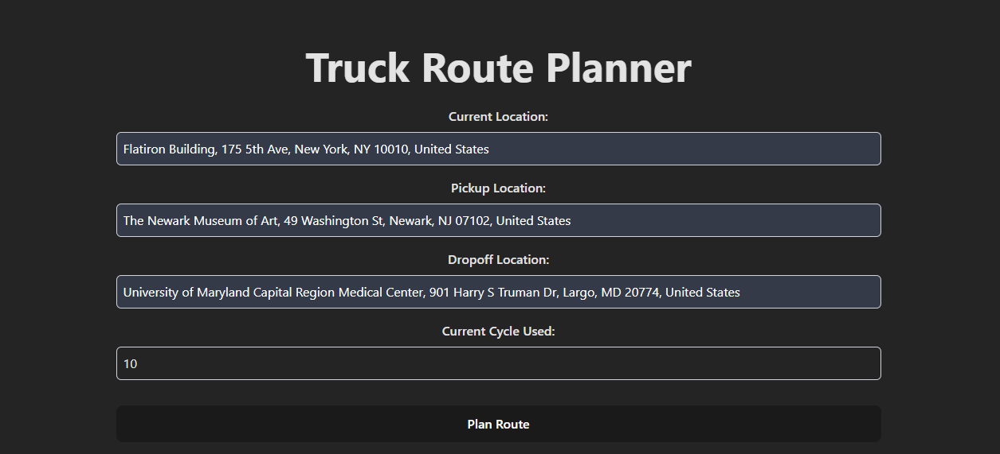
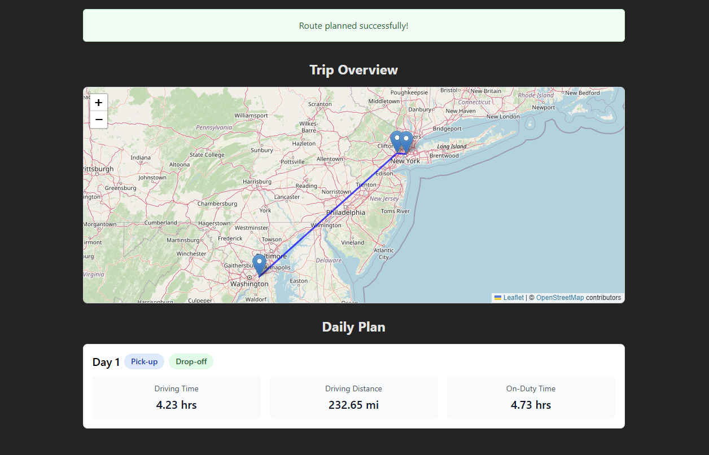
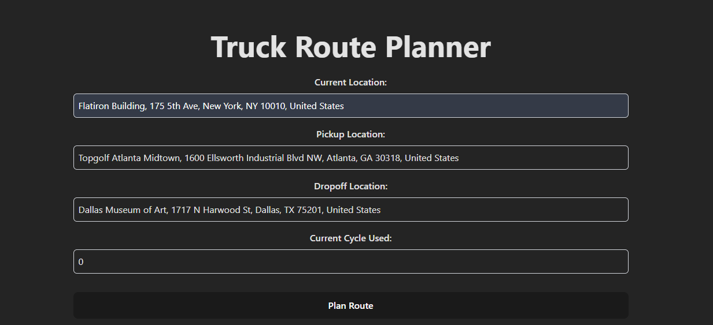
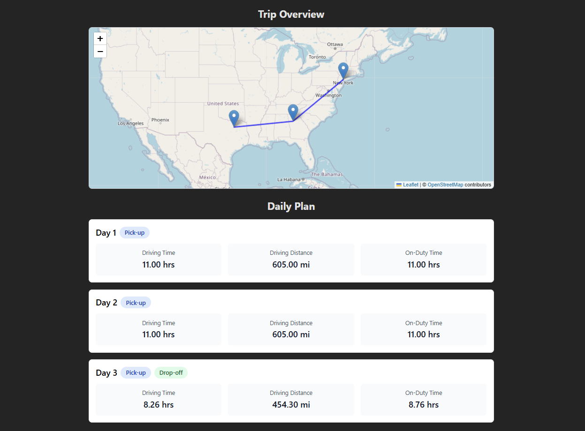

# Truck Planner

A Full Stack Web App that helps create daily travel plans for trucks. Enter current, pickup and dropoff locations in the frontend; the backend computes a simple route and daily plan which is displayed on an interactive Leaflet map.

*Note:* This is a monorepo which contains the backend (Python Django) and frontend (React TS) in the same repo.

## Key goals

- Rapidly prototype route planning and visualization
- Provide a minimal API for generating daily plans from location inputs
- Demonstrate React frontend map integration with Leaflet and a Django API

## Tech stack

- **Backend**: Python v3.11, Django v5.2, OpenRouteService (for geolocation and travel distances)
- **Frontend**: React v19.2, TypeScript, Vite
- **Map**: Leaflet + react-leaflet
- **Tooling**: npm, ESLint, Vite, venv


## Folder structure

Top-level repository layout (paths are workspace-relative):

```
.
├── README.md
├── .vscode/                    # vscode debugger config
├── backend                     # Django backend
│   ├── manage.py
│   ├── .env                    # where your .env should be located for local dev
│   ├── db.sqlite3              # sqlite3 DB not used for this project
│   ├── requirements.txt
│   ├── config                  # Django's config
│   │   ├── __init__.py
│   │   ├── asgi.py
│   │   ├── settings.py
│   │   ├── urls.py
│   │   └── wsgi.py
│   └── routes                  # route and logic
│       ├── __init__.py
│       ├── trip_planner.py
│       ├── services.py
│       ├── views.py
│       ├── urls.py
│       └── utils.py
└── frontend                    # React frontend
    ├── index.html
    ├── .env                    # where your .env should be located for local dev
    ├── package.json
    ├── tsconfig.json
    ├── vite.config.ts
    ├── public
    └── src
        ├── main.tsx
        ├── App.tsx
        ├── index.css
        ├── assets
        ├── components
        │   ├── MapComponent.tsx
        │   └── DailyPlanComponent.tsx
        ├── services
        │   └── api.ts
        └── types
            └── api.types.ts
```

## Screenshots

### Case 1: Short Route Planning

**Input:**



**Output:**



### Case 2: Long Distance Route

**Input:**



**Output:**



## How To Run - For Developers

**Backend**

```powershell
cd backend
python -m venv .venv
.venv\Scripts\Activate.ps1   # PowerShell
pip install -r requirements.txt
python manage.py runserver
```

**Frontend**

```bash
cd frontend
npm install
npm run dev
```


## Future Enhancements
1. Enchance the trip duration plan to include rest, stops, sleeper berth, fuelling, etc.
2. Include stops, rest, fuelling in the map
3. Add more inputs (driving conditions, vehicle speed, weather) to improve trip planning